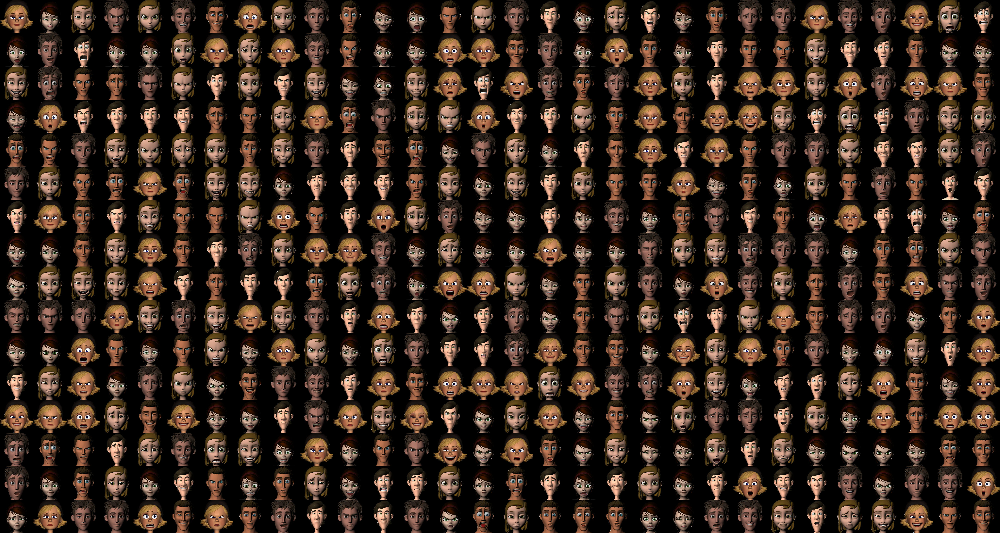

# 2D-face-Caricature 
**Based on stylegan2 and [Justin Pinkney's Website](https://www.justinpinkney.com)**

## 1.Prepare Dataset
### a.[FERG_DB_256](http://grail.cs.washington.edu/projects/deepexpr/ferg-2d-db.html) 
That's a dataset from Washington University.
I choose around 700 photos from those characters which has more than 100 from each one with different expressions.
Use dataset_tool.py to create .tfrecord format.

### b.yuanshen
To be done. Currently can't get hundreds of faces of yuanshen chracters.

## 2.Transfer Learning
Choose a Pretrained model that matches the size of dataset.
The less FID of the model, the better.
**Gotta to change some parameters in training_loop.py to control the interval between two snapshots**. 
Because after a small amount of training, it will acheive a good results and it's also not suitable to training too long. 
You need to choose and try to find out which snapshot get the best performance.

## 3.Blending Models
It's also a process to try and find in which resolution to exchange two models weights is the best

## 4.Projecting and Generating
### a.Aligned photos at first.
### b.Project them to latent space and save as .npy format with project_images.py
### c.Use blended model to regenerate Caricature photos
